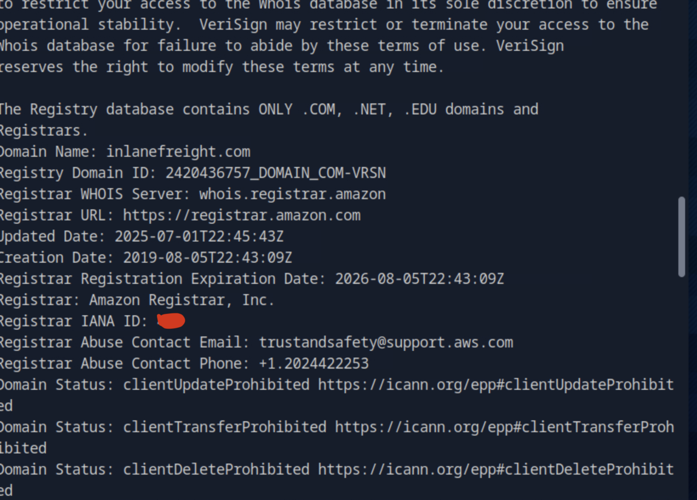
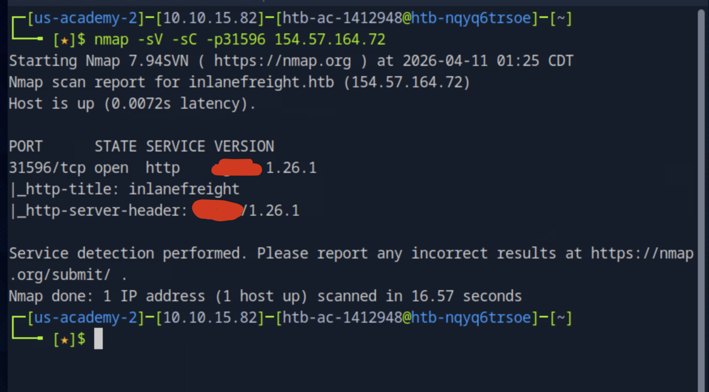
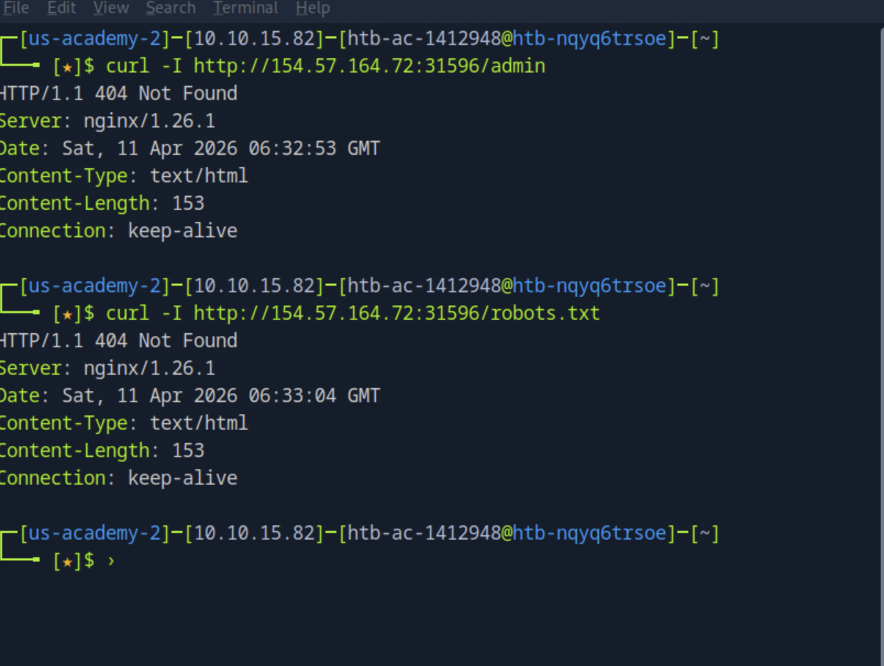
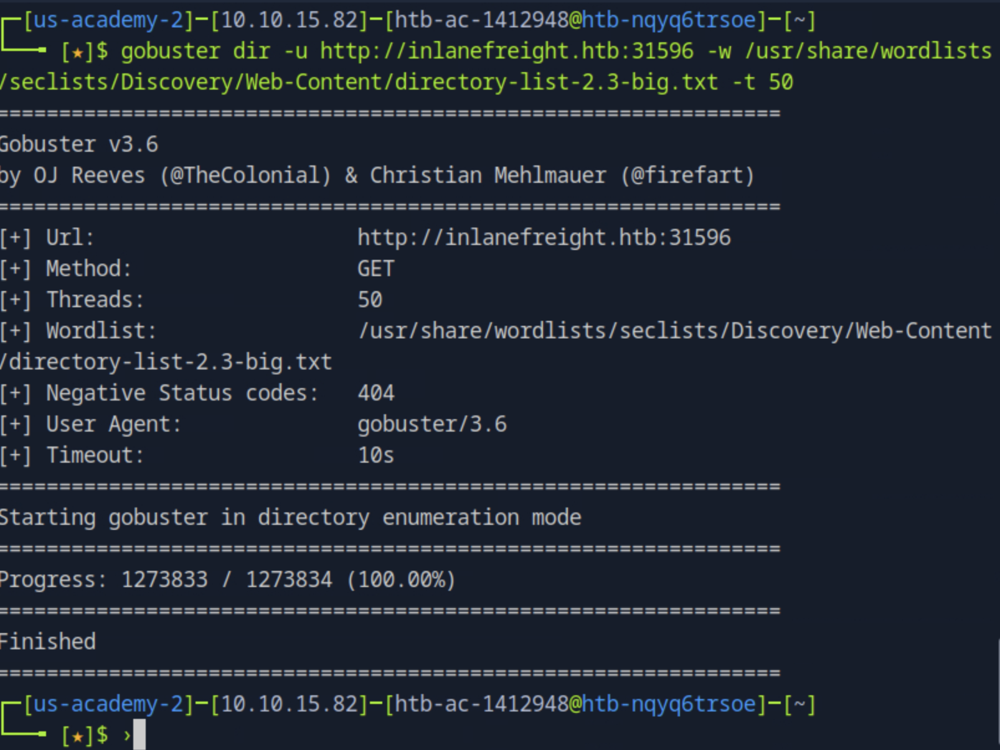
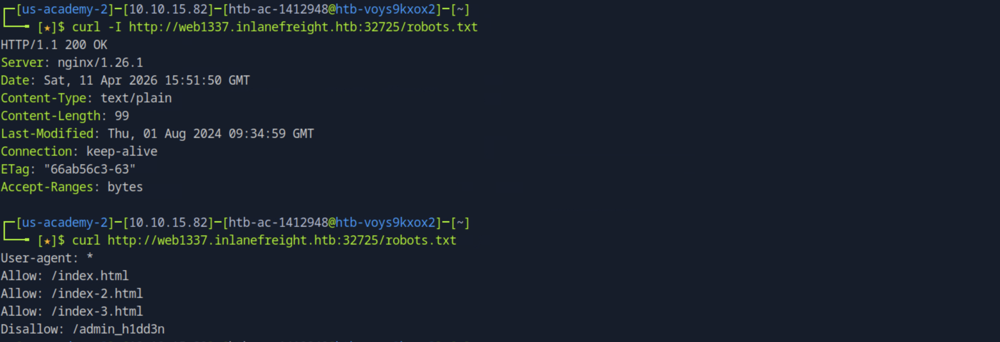
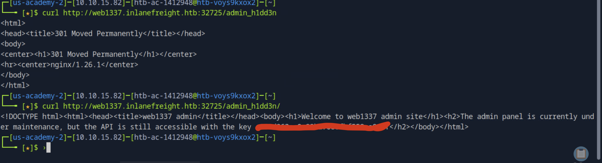
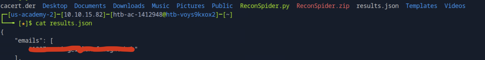
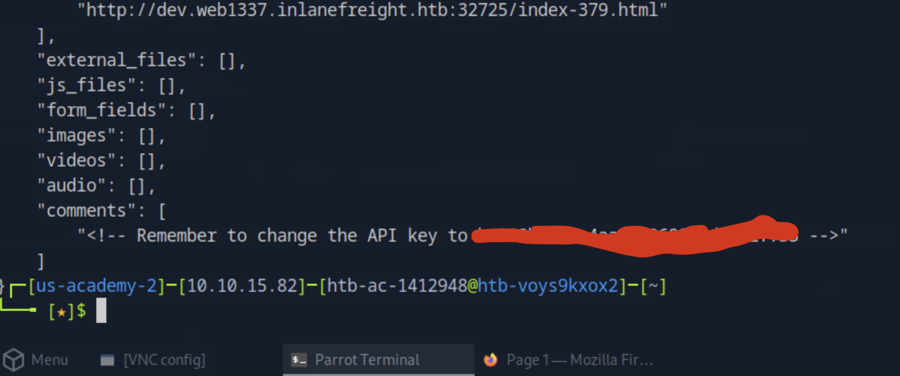

# 🌐 Information Gathering - Web Edition

> **Platform:** HTB Academy
> **Path:** CPTS Journey
> **Status:** ✅ Completed

---

## Overview

This lab covers web reconnaissance techniques including WHOIS lookups, subdomain enumeration, directory brute forcing, and web crawling to extract sensitive information.

---

## Question 1 — IANA Registrar ID of inlanefreight.com

Used `whois` to look up domain registration details:

```bash
whois inlanefreight.com
```



The output revealed registrar information including the **IANA Registrar ID**.

---

## Question 2 — HTTP Server Software on inlanefreight.htb

Used `nmap` with service detection to identify the web server:

```bash
nmap -sV -sC -p31596 154.57.164.72
```



The scan revealed the **HTTP server software** running on the target.

---

## Question 3 — API Key in Hidden Admin Directory

### Step 1: Manual Enumeration

Started with basic checks — looking for `/admin` and `robots.txt`:



Nothing found manually.

### Step 2: Directory Brute Force

Tried directory brute forcing with multiple wordlists:

```bash
gobuster dir -u http://inlanefreight.htb:31596 -w /usr/share/wordlists/dirb/common.txt
```



No results — suspected the content might be inside a subdomain.

### Step 3: Subdomain Enumeration

```bash
gobuster vhost -u http://inlanefreight.htb:31596 \
  -w /usr/share/wordlists/seclists/Discovery/DNS/subdomains-top1million-110000.txt \
  --append-domain \
  -t 50
```

> **Lesson learned:** `--append-domain` flag is required for vhost enumeration to work correctly.


**Found subdomains:**
```
web1337.inlanefreight.htb
dev.web1337.inlanefreight.htb
```

### Step 4: Directory Brute Force on Subdomains

Ran directory brute force on both subdomains — no results from automated tools.

### Step 5: Manual Check + robots.txt

Manually visited `web1337.inlanefreight.htb` and checked `robots.txt`:





> **Key takeaway:** Always check `robots.txt` — it can expose hidden paths that automated tools miss.

**Found the API key in the hidden admin directory.** ✅

---

## Question 4 — Email Address Found by Crawling inlanefreight.htb

Used **Scrapy** to crawl the full domain and extract contact information:



**Found the email address** embedded in the crawled pages. ✅

---

## Question 5 — New API Key the Developers Are Changing To

The same Scrapy crawl that found the email also revealed developer notes containing the **new API key**:



✅

---

## Summary

| Question | Technique Used | Tool |
|----------|---------------|------|
| IANA Registrar ID | WHOIS Lookup | `whois` |
| HTTP Server Software | Service Detection | `nmap -sV` |
| Hidden Admin API Key | Subdomain + robots.txt | `gobuster` + manual |
| Email Address | Web Crawling | `scrapy` |
| New API Key | Web Crawling | `scrapy` |

---

## Key Lessons Learned

- `robots.txt` can expose sensitive paths — **always check it manually**
- Subdomain enumeration requires `--append-domain` flag in gobuster vhost mode
- Automated tools don't always find everything — **manual inspection is essential**
- Web crawling with Scrapy can extract hidden data from linked pages
- Information gathering is layered: WHOIS → DNS → HTTP → Crawling

---

## Tools Used

| Tool | Purpose |
|------|---------|
| `whois` | Domain registration info |
| `nmap` | Service and version detection |
| `gobuster` | Directory and subdomain brute forcing |
| `scrapy` | Web crawling and data extraction |

